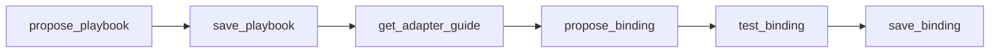

# Create a playbook with your agent

Put structure, bindings, and access rules together. Your agent uses MCP authoring tools to validate and save files — you review each step before anything is persisted.

## Prerequisites

- [Explore your connected data](explore-connected-data.md)
- [Draft playbook structure](suggest-playbook-structure.md)
- [Access rules defined](define-access-rules.md)
- Admin MCP token
- Anything Graph running (`anythinggraph start`)

## Authoring workflow



**Golden rule:** Save the **same JSON/YAML you wrote** — not debug or compiled output from propose responses.

## Step 1 — Validate and save the playbook

Prompt your agent:

```
Using anythinggraph-cli MCP with admin token:

1. propose_playbook with this compact JSON: { ... your draft ... }
2. If valid, save_playbook to playbooks/my-crm-access.json
3. get_playbook_context to confirm it loaded
```

Playbook entities use `identifier` and `attributes`. Bindings use `id` and `fields` for physical columns.

## Step 2 — Author bindings per source

One binding file per **source key** in the playbook's `sources` map:

| Source key | Binding file |
|------------|--------------|
| `postgres` | `bindings/my-crm-access.postgres.yaml` |
| `csv` | `bindings/my-crm-access.csv.yaml` |

For each source:

```
1. list_sources — confirm source_id (e.g. warehouse_pg)
2. get_adapter_guide(source_id) — REQUIRED before binding
3. introspect_source — confirm table/collection names
4. propose_binding — compact YAML only (source_id, entities, relationships)
5. test_binding with execute=true — use real id values from sample_source
6. save_binding — same YAML you proposed
```

### Binding template (Postgres)

```yaml
source_id: warehouse_pg

entities:
  crm_user:
    from: users
    id: user_id
    fields: [full_name]

  crm_account:
    from: accounts
    id: account_name
    fields: [industry]

relationships:
  owns_account:
    object: crm_account
    link_column: owner_user_id
```

**Never put** credentials, raw SQL, or `adapter` in binding YAML.

## Step 3 — Test end to end

```
For playbook my-crm-access:
1. query_graph — resolve crm_user by name "Alex Anderson"
2. query_graph — count owns_account for crm_account
3. Show the proof envelope
```

Or validate from the shell:

```bash
curl -s http://127.0.0.1:8787/query \
  -H 'Content-Type: application/json' \
  -d '{
    "playbook_id": "my-crm-access",
    "resolve": { "entity": "crm_user", "by_name": "Alex Anderson" },
    "count": { "relationship": "owns_account", "object_entity": "crm_account" }
  }'
```

## Step 4 — Reload if needed

If the playbook does not appear in `list_playbooks` after save:

```bash
anythinggraph stop && anythinggraph start
```

## Common mistakes

| Mistake | Fix |
|---------|-----|
| Saving compiled/debug YAML from `propose_binding` | Save only your authored compact YAML |
| Wrong `source_id` in binding | Copy from `list_sources`, not invented names |
| Missing `get_adapter_guide` for Mongo/REST/Salesforce | Call guide before `propose_binding` |
| Skipping `test_binding(execute=true)` | Test with real ids before save |

## File layout when done

```text
playbooks/my-crm-access.json
bindings/my-crm-access.postgres.yaml
bindings/my-crm-access.csv.yaml    # if federated
profiles/local.yaml                # credentials only
.env                               # secrets only
```

## Reference examples

- [Example 1: Simple CRM](../playbooks/example-1.md)
- [Example 2: CRM + payroll](../playbooks/example-2.md)
- [Entity mapping and relationships](../playbooks/entity-mapping.md)

## Next step

Put the playbook into everyday agent use — [govern your agent with playbooks](govern-agent-with-playbooks.md).
