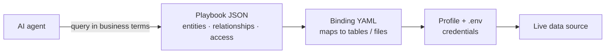

# Playbook overview

A **playbook** is your organization's business dictionary, relationship map, and access rules — shipped as a JSON file and queried against **live data** without copying it into prompts.

When an agent asks *"How many accounts does Alex Anderson own?"*, the playbook tells the runtime:

- What **Alex** means (`crm_user` with identifier `user_id`)
- What an **account** means (`crm_account`)
- How ownership is modeled (`owns_account` relationship)
- Which rows Alex is **allowed** to see (ReBAC rules)
- Which **source** each entity comes from (Postgres, CSV, Salesforce, …)

The agent speaks in playbook terms. Anything Graph compiles governed queries and returns structured proof.

## How it works



**Typical flow:**

1. Agent loads playbook vocabulary (`crm_user`, `owns_account`, …).
2. User is resolved to a subject id (e.g. Alex → `user_id`).
3. Runtime picks the right binding file from the playbook's `sources` map.
4. Binding YAML maps entity names to physical tables, columns, or API paths.
5. Profile supplies credentials; adapter runs a read-only query.
6. Access rules filter results to what the subject may see.

## Playbook vs binding

| | Playbook (`playbooks/<id>.json`) | Binding (`bindings/<id>.<source>.yaml`) |
|---|----------------------------------|-------------------------------------------|
| **Purpose** | Business meaning and governance | Physical data location |
| **Contains** | Entity names, attributes, relationships, routing, access rules | Table/file names, column mappings, link columns |
| **Audience** | Agents, product owners, security | Engineers mapping schema to vocabulary |
| **Credentials** | Never | Never — only `source_id` pointing at profile |
| **Changes when** | Business concepts change | IT renames a column or moves a table |

**Playbook** answers: *What is a customer? How do users relate to accounts? Who may see payroll?*

**Binding** answers: *Which Postgres table is `crm_user`? Which column is `full_name`? What foreign key links `owns_account`?*

One playbook can span multiple sources. Each distinct source key gets its own binding file (e.g. `crm-payroll-access.postgres.yaml` and `crm-payroll-access.csv.yaml`).

## Playbook JSON structure

| Block | Purpose |
|-------|---------|
| `id`, `name`, `description` | Playbook identity |
| `entities` | Business objects and their identifier + attributes |
| `relationships` | Named edges between entities (`from` → `to`) |
| `sources` | Routes each entity to a source key (`postgres`, `csv`, `salesforce`, …) |
| `access` | Optional ReBAC — who the subject is and what they may read |

Minimal example:

```json
{
  "id": "simple-crm-access",
  "name": "Simple CRM access",
  "description": "Sales rep sees accounts they own in Postgres.",
  "entities": {
    "crm_user": { "identifier": "user_id", "attributes": ["full_name"] },
    "crm_account": { "identifier": "account_name", "attributes": ["industry"] }
  },
  "relationships": {
    "owns_account": { "from": "crm_user", "to": "crm_account" }
  },
  "sources": {
    "crm_user": "postgres",
    "crm_account": "postgres"
  },
  "access": {
    "subject": "crm_user",
    "subject_id": "user_id",
    "allow": [
      { "relationship": "owns_account", "resource": "crm_account" }
    ]
  }
}
```

Field names in the playbook (`user_id`, `full_name`) are the **stable vocabulary**. Physical column names are mapped in binding YAML only where they differ.

## Authoring with MCP

With an admin token connected via MCP, use:

- `propose_playbook` → validate compact JSON
- `save_playbook` → write to `playbooks/<id>.json`
- `introspect_source` → discover schema for mapping
- `propose_binding` → validate binding YAML
- `save_binding` → write to `bindings/<playbook_id>.<source>.yaml`

See [Entity mapping and relationships](entity-mapping.md) and [Role-Based Access Control](role-based-access-control.md) for step-by-step guides, or walk through [Example 1](example-1.md) and [Example 2](example-2.md).

## Next steps

- [Entity mapping and relationships](entity-mapping.md) — map tables and columns to playbook entities
- [Role-Based Access Control](role-based-access-control.md) — govern who sees what
- [Example 1: Simple CRM](example-1.md) — single Postgres source
- [Example 2: CRM + payroll](example-2.md) — Postgres and CSV together
- [Connectors](../connectors/index.md) — connect data sources first
